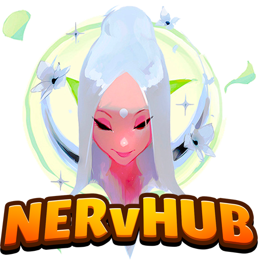

<h1 align="center">
   
  
   
  KINGS ORIGIN
   
</h1>

<h4 align="center">Herramienta que permite centralizar los assets de la red de <a href="https://github.com/Nervelink/NervelinkCenter" target="_blank">Nervelink</a>.</h4>

  
  

  <a href="#informacion">Informacion</a> •
  <a href="#uso">Uso</a> •
  <a href="#descargar">Descargar</a> •
  <a href="https://docs.google.com/document/d/1L7mTHl5SNRgCSEXTF9G2nw_mhExeNmNbEBv5wdmowUw/edit?usp=sharing">Documentación</a> •
   •
  <a href="#licencia">Licencia</a>

<em>Panel de control inicial de NERvHUB.</em>

## Informacion

     
NervHUD es una herramienta para el motor gráfico de Unity3D, que se encarga de la instalación y desinstalación de engines bajo la capa de Unity3D.
Esta herramienta escrita en C# y desarrollada principalmente para la versión 2018+, se inicia al principio de iniciar el motor para poder elegir la instalación de algún engine o herramienta.

En su versión 1.0.0, tiene un enlace a la tienda de unity para descargar e instalar el motor de animación (Tween) DOTween. Seguidamente tiene dos opciones como engines internos bajo la capa de Unity3D que son PandoraCrystal y CrystalMatch.

* **PandoraCrystal:** Es un engine desarrollado exclusivamente para el videojuego **The Legend of Origen**. Un engine para juegos RPGs / Tácticos / Fantasía. En los que predomina la arquitectura modular, contiene un administrador de modulos interno para dividir la funcionalidad en varios sectores.

* **CrystalMatch:** Es un engine desarrollado exclusivamente para el videojuego **Horizon Crystal**. Para juegos 3 Match destinados a móviles.

Por último hay dos herramientas adicionales, NervSDK y NervLauncher. El primero es una librería de funcionalidades tanto para el editor como para el juego en sí. El segundo es una herramienta para gestionar actualizaciones con un launcher tanto en Escritorio como en dispositivos Móviles.

## Uso

Para desarrollo

> Instalar el paquete de unity más reciente situado [aquí](https://github.com/Nervelink/NERvHUB/releases).

> Si no se abre ninguna ventana emergente de Nervhub, dirigirse a Nervelink/Nervhub.

> Seleccionar la opción que se desea instalar.

> Click en instalar.

> Esperar a que termine la instalación.

> Cerrar NervHUD.

Al instalar los diferentes engines se crearán unas definiciones de símbolos globales para cada uno de los engines o herramientas. Estas definiciones sólo se borrarán automáticamente en el caso de que los engines sean borrados directamente desde la herramienta NervHUD, sino se tiene que eliminar manualmente.

## Descargar

Usted puede [descargar](https://github.com/Nervelink/NERvHUB/releases) la última versión instalable de **NERvHUB**.

## Colaboradores

1. ¡Bifurcalo!
2. Crea tu rama de características: `git checkout -b my-new-feature`
3. Confirme sus cambios: `git commit -am 'Add some feature'`
4. Empuje la rama: `git push origin my-new-feature`
5. Envíe una pull request: D

El proyecto ahora es mantenido por [Moon Antonio](https://github.com/moonantonio) con ayuda de los colaboradores ([lista](https://github.com/Nervelink/NERvHUB/graphs/contributors)).

<!-- ALL-CONTRIBUTORS-LIST:START - Do not remove or modify this section -->
<!-- prettier-ignore -->

| [ <b>Moon Antonio</b>](https://moonantonio.github.io/)   |  |  |  |  | | |
| :-----------------------------------------------------------------------------------------------------------------------------------------------------------------: | :-----------------------------------------------------------------------------------------------------------------------------------------------------------------------: | :-------------------------------------------------------------------------------------------------------------------------------------------------------------------: | :-------------------------------------------------------------------------------------------------------------------------------------------------------------: | :------------------------------------------------------------------------------------------------------------------------------------------------------------: | :---------------------------------------------------------------------------------------------------------------------------------------------------------------------------: | :-----------------------------------------------------------------------------------------------------------------------------------------------------------: |

<!-- ALL-CONTRIBUTORS-LIST:END -->

## Licencia
Privado

---

> [moonantonio.github.io](https://moonantonio.github.io/) &nbsp;&middot;&nbsp;
> GitHub [@moonantonio](https://github.com/moonantonio) &nbsp;&middot;&nbsp;
> Twitter [@AntonioMoonNull](https://twitter.com/AntonioMoonNull)
